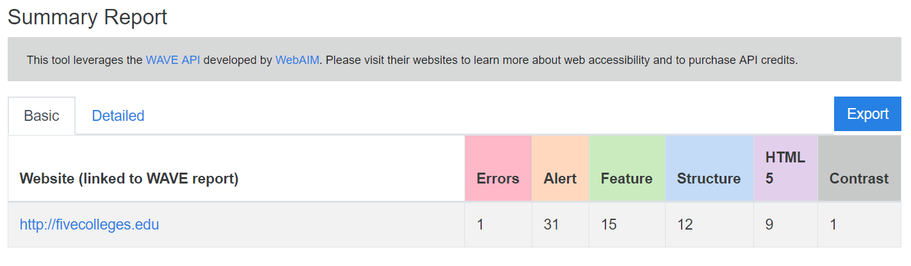
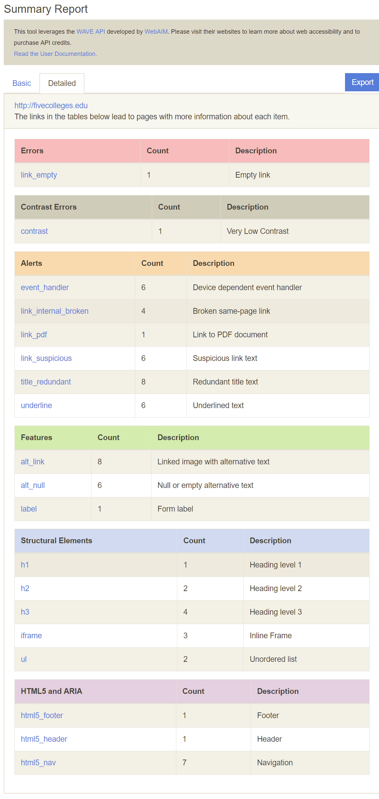
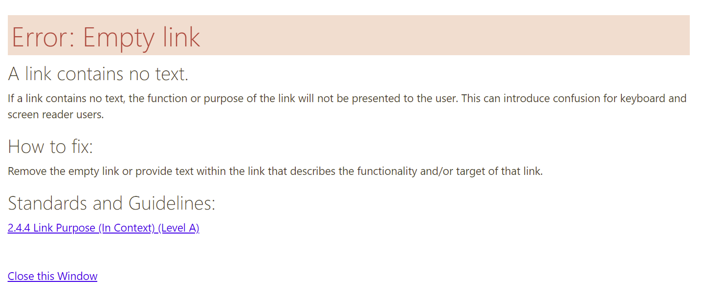

# Table of Contents

- [Table of Contents](#table-of-contents)
- [Overview](#overview)
	- [WAVE Accessibility Checker](#wave-accessibility-checker)
- [Usage](#usage)
	- [Reports](#reports)
	- [Export](#export)
- [Interpreting Results](#interpreting-results)

# Overview
This Accessibility Tool is used to batch-test files for accessibility with the WAVE checker, created by [WebAIM](http://webaim.org). It uses the [WAVE API](https://wave.webaim.org/api/). Once the tool is run, it generates reports in CSV, HTML, and JSON formats. There are two options for these reports - Summary and Details. The Summary report shows the numbers of errors, alerts, features, structure elements, ARIA and HTML5 elements, and contrast violations on a given page. The Detailed report goes further and lists the details of each item that has been flagged by WAVE (ex. "Missing alt text") along with how many of each there are on the page.

The Github Repository for this project currently resides at https://github.com/alexroseb/scl_a11y_eval_tool.

## WAVE Accessibility Checker

WAVE is a project created by [WebAIM](http://webaim.org) that can automatically check webpages for accessibility compliance. It uses a range of guidelines, focusing on [WCAG 2.0](https://www.w3.org/WAI/WCAG20/quickref/). It is a good starting point to check accessibility of websites, but as an automated tool it can't catch everything and the results need to be reviewed manually. We also suggest using other checkers, like [aXe](https://www.deque.com/axe/), to run further tests.

# Usage

1. Confirm that you have a WAVE API key by [logging into the API website](https://wave.webaim.org/api/login). If you don't have one, [create a new WAVE API username](https://wave.webaim.org/api/register). An API key will automatically be generated for you and you will get 100 free credits.
2. If you don't have enough API credits, [order some more](https://wave.webaim.org/api/order).
3. On the Accessibility Tool, input your WAVE API key. The first time you run a report, it will show that you have 0 credits. Once you have run the first report, it will show the correct number of credits.
4. Select which type of report you would like to run. A Summary report uses 1 credit **per URL** and a Summary and Detail report uses 2 credits **per URL**.
5. Input the URLs of each page you want to test, each on their own line.
6. Click "Submit", and the report will be run. This will take a few seconds for each of the URLs.

## Reports
1. If you have run a Summary report, you will only see one tab, with the details from each URL on each row of the table. Clicking on each of the URLs in the list will bring you to the full report generated by WAVE for that page. An example page showing the summary report for http://fivecolleges.edu: 
2. The Summary and Detail report contains a second tab with further information about each page. An example page showing the detailed report for http://fivecolleges.edu: 
3. If you click on any of the item IDs in the detailed view, it will open a new tab with further information about that item. An example page showing the details for an empty link: 

## Export
You can download reports in CSV, HTML, and JSON formats. Choose "Export" and a menu will appear where you can choose which type of export you want and what you would like to name the file. The types of reports are as follows:

* CSV: This will create a spreadsheet with the data. This could be used to import data into another program, or as a way to see all the data together and work with it. This file can be opened in Microsoft Excel or any other spreadsheet program. [An example CSV report for fivecolleges.edu](examples/FiveCollegesExample.csv).
* HTML: This generates a report similar to what you see on the main Accessibility Tool page, except it is available offline and can be accessed anytime. It is the most visual out of all the formats. Once the file has downloaded, clicking on it will open it in your default internet browser. It can also be edited in a plain-text editor. [An example HTML report for fivecolleges.edu](examples/FiveCollegesExample.html). (If that link takes you just to the HTML code, you can [use this bookmarklet to view a rendered page](http://htmlpreview.github.io/)).
* JSON: This directly shows the output from the WAVE API call. It can be opened and edited in a plain-text editor and could be used as an import into another program. [An example JSON report for fivecolleges.edu](examples/FiveCollegesExample.json).

# Interpreting Results

As stated above, WAVE is an automated checker and therefore simply running a report is not enough. The reports run using this tool will generate links to the native WAVE reports, where there will be specific details about each of the items detected in the bulk report. 

The most important next step is to carefully review everything that the checker reported as an error. Accessible webpages should have 0 errors, and even then they might have some flaws that WAVE didn't pick up. These errors should be fixed as quickly as possible.

Next, you should review everything flagged as alerts. These are areas where manual review is needed - where the automated tool can't confirm if there is an issue. The same goes for items where there is a contrast warning.

Finally, take time to review the structural elements and features. These help show how users and screenreaders will navigate and view the site.
